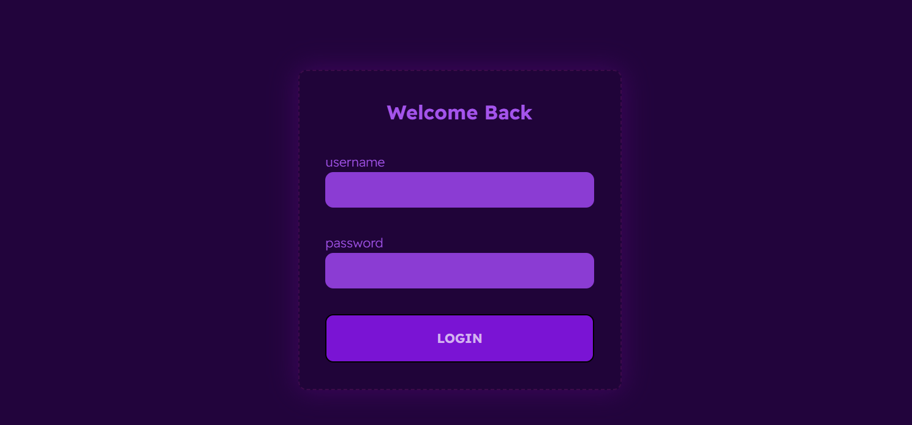

# App

## Dev enviroment

clone repo

```
    git clone https://github.com/GuillermoCruzFuente/app-test.git
```

open folder and install dependencies

```
    cd app-test
    npm install
```

and finally run the dev command

```
    npm run dev
```

## How to update production

on every push to main branch the [render platform](https://render.com) handle the build and deploy of production [here](https://birthtracker.onrender.com/)

## How to login

credentials represented as a js object, make sure to remove quotes (")

```
    {
        username: "Guillermo"
        password: "Factumex"
    }
```


